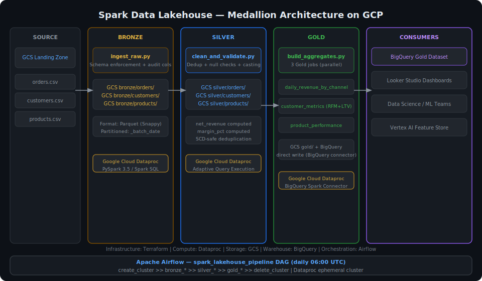

# Spark Data Lakehouse on GCP


Production-grade data lakehouse built on Google Cloud using the Medallion Architecture (Bronze → Silver → Gold). Raw e-commerce data lands in GCS, flows through PySpark cleaning and validation jobs running on Dataproc, and surfaces as business-ready aggregates in BigQuery — all orchestrated by Apache Airflow with ephemeral Dataproc clusters to minimise cost.

## Architecture



## Medallion Architecture

| Layer | Path | Format | Purpose |
|---|---|---|---|
| **Bronze** | `gs://bucket/bronze/` | Parquet (Snappy) | Raw data as-is + audit columns |
| **Silver** | `gs://bucket/silver/` | Parquet (Snappy) | Cleaned, deduped, validated |
| **Gold** | `gs://bucket/gold/` + BigQuery | Parquet + BQ tables | Business aggregates, BI-ready |

## Project Structure

```
spark-data-lakehouse-gcp/
├── jobs/
│   ├── bronze/
│   │   └── ingest_raw.py           # Schema-enforced ingestion → Bronze Parquet
│   ├── silver/
│   │   └── clean_and_validate.py   # Dedup + cleaning + net_revenue
│   └── gold/
│       └── build_aggregates.py     # 3 Gold aggregations → GCS + BigQuery
├── airflow/
│   └── dags/lakehouse_pipeline_dag.py
├── terraform/
│   └── main.tf                     # GCS bucket, BQ dataset, Dataproc, IAM
├── docker/
│   └── docker-compose.yml          # Local Spark cluster (3 workers + history)
├── tests/
│   ├── test_bronze.py
│   └── test_silver.py
├── snapshots/
│   └── architecture.svg
├── .env.example
└── requirements.txt
```

## PySpark Jobs

**Bronze — `ingest_raw.py`**
Reads raw CSV from the GCS landing zone, enforces a strict schema (rejects malformed records into a dead-letter path), and appends audit columns (`_ingested_at`, `_source_file`, `_batch_date`) before writing partitioned Parquet to the Bronze zone.

**Silver — `clean_and_validate.py`**
Applies data quality rules: drops records missing primary keys or with invalid quantities, deduplicates on primary key keeping the latest ingest, normalises string casing, casts date fields, fills nulls, and computes `net_revenue` and `margin_pct`.

**Gold — `build_aggregates.py`**
Produces three business aggregations, each writing to GCS Gold Parquet and directly to BigQuery via the Spark–BigQuery connector:
- `daily_revenue_by_channel` — orders, revenue, AOV, unique customers per day/channel
- `customer_metrics` — full RFM profile with LTV tier and churn risk per customer
- `product_performance` — units sold, revenue, gross profit, unique buyers per product

## Airflow DAG

`spark_lakehouse_pipeline` runs daily at 06:00 UTC:
```
create_cluster
    ├── bronze_orders ──► silver_orders ──►
    ├── bronze_customers ► silver_customers ►──► gold_daily_revenue
    └── bronze_products ─► silver_products ──►──► gold_customer_metrics
                                                 └── gold_product_perf
                                                         └── delete_cluster
```
The Dataproc cluster is created at the start of each run and deleted on completion — ephemeral by design.

## Quick Start

```bash
# 1. Clone + install
git clone https://github.com/jaiminbabariya7/spark-data-lakehouse-gcp.git
cd spark-data-lakehouse-gcp
pip install -r requirements.txt

# 2. Configure environment
cp .env.example .env  # Fill in GCP_PROJECT_ID, GCS_LAKEHOUSE_BUCKET

# 3. Provision infrastructure
cd terraform
terraform init && terraform apply -var="project_id=$GCP_PROJECT_ID"

# 4. Local development with Docker
cd docker && docker-compose up -d

# 5. Run tests
pytest tests/ -v --cov=jobs

# 6. Submit to Dataproc manually
gcloud dataproc jobs submit pyspark jobs/bronze/ingest_raw.py \
    --cluster=lakehouse-cluster --region=us-central1 \
    -- --table=orders
```

## Tech Stack

| Component | Technology |
|---|---|
| Compute | Google Cloud Dataproc (PySpark 3.5) |
| Object Storage | Google Cloud Storage (Bronze / Silver / Gold) |
| Data Warehouse | Google BigQuery (Gold layer) |
| Orchestration | Apache Airflow 2.8 + Dataproc provider |
| Infrastructure | Terraform 1.6 |
| Local Dev | Docker Compose (Bitnami Spark) |
| Language | Python 3.11 |
| Testing | pytest + pyspark local mode |
| Optimisations | Adaptive Query Execution, Parquet Snappy, partitioning |